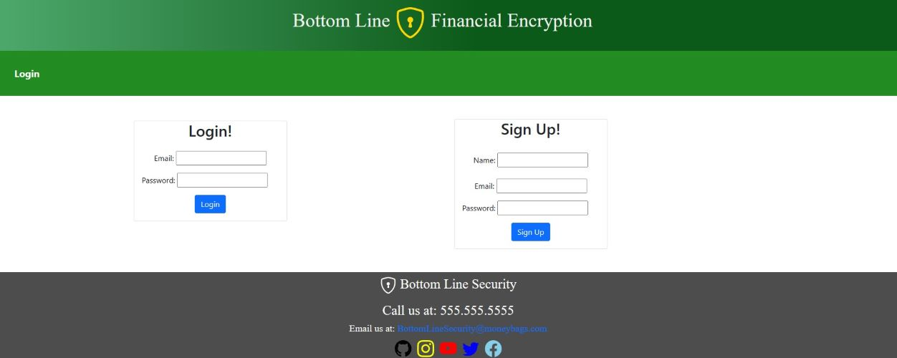
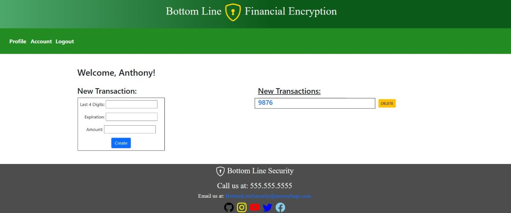
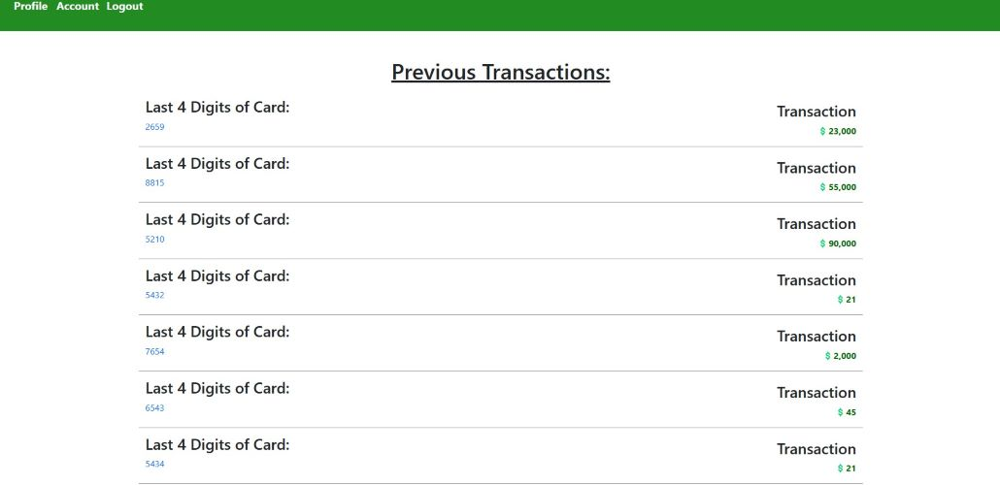

# Credit-Card-Processing

## Table of Contents
- [Description](#description)
- [Visuals](#visuals)
- [Links](#links)
- [Collaborators](#collaborators)

***

## Description

Here at Bottom Line Financial we wanted to create an encryption model for credit cards. Financial data is the worst to have stolen. Post-covid, money has become more important than ever, to which we say: better safe than sorry.
The motivation for this project was to create something that we could 
be able to show future employers a system we’ve built to safely encrypt data

AS A USER, I want to be presented with the homepage. Upon logging in, I’m presented with the option to add new transactions and cards to be encrypted and stored.

***

## Visuals

***

## Links
Link to our project: https://github.com/M5Justin/Credit-Card-Processing

***

## Collaborators
[Carson's GitHub](https://github.com/carsondipan)

[Samson's GitHub](https://github.com/SamsonKnightz)

[Justin's GitHub](https://github.com/M5Justin)

[Kyle's GitHub](https://github.com/KMPhillips20)